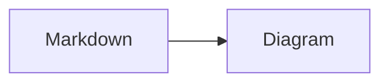

# Git MD Viewer

一个可嵌入 React 宿主应用的 Git Markdown Documentation Viewer，当前实现蓝图的 Phase 1 核心能力。

## 开发

```bash
pnpm install
pnpm dev
```

## 发布 npm 包

推送与 `package.json` 中版本一致的 Git 标签（例如版本为 `0.1.0` 时推送 `v0.1.0`），会触发 GitHub Actions 构建并发布 `@md-with-git/viewer` 到 npm。发布采用 npm Trusted Publishing（OIDC），不需要在 GitHub 仓库保存 `NPM_TOKEN`。

首次发布前需要：

1. 在 npm 创建或确认自己拥有 `@md-with-git` 组织，并确保该包名可用。
2. 在 npmjs.com 先手动发布一次该包，或创建同名占位包；Trusted Publisher 只能为 npm 中已存在的包配置。
3. 在 npm 包设置的 **Trusted Publisher** 中选择 GitHub Actions，并精确填写 GitHub 用户/组织、仓库名和工作流文件名 `publish-npm.yml`，允许 `npm publish`。
4. 为 npm 帐户启用双重验证；建议在验证发布成功后，将包的 Publishing access 设为“Require two-factor authentication and disallow tokens”。

发布前可运行 `pnpm pack --dry-run` 检查实际将上传的文件。每个 npm 版本只能发布一次；需重新发布时请先升级 `package.json` 的版本并创建相应的新标签。

打开一个公开 GitHub 仓库中的文档空间，例如 Vite 的 `docs/guide`：

```text
/docs/vitejs/vite/docs/guide?scope=docs%2Fguide
/docs/vitejs/vite/docs/guide/features.md?scope=docs%2Fguide&ref=main
```

`scope` 是要渲染的文档目录。Viewer 不把整个 Git 仓库作为浏览目标；Git 仓库只负责提供文档文件、资源和版本数据。

首页的“打开 Git 仓库中的文档目录”表单支持填写 GitHub/Bitbucket、仓库和文档目录；本地文档与本地 Git 仓库使用独立入口。
设置本地 Git 仓库时，先选择 `.git` 所在的项目根目录，再填写要渲染的文档目录 `scope`。

## 访问私有仓库

本项目不实施 OAuth，也不需要自建后台。使用者在“设置在线 Git 仓库”中粘贴自己的访问令牌，Viewer 在每个 API 请求中以 `Authorization: Bearer <token>` 发送它。

令牌只保存到浏览器的 `sessionStorage`，并按“平台 + owner/workspace + 仓库”隔离：不会写入 URL、工作区设置或仓库配置；关闭浏览器会话后失效。它仍然是浏览器端机密，请只在受信任的设备和本站点上使用，避免将 token 写进 `.env`、源码或截图。

### GitHub

1. 打开 GitHub 的 [Fine-grained personal access tokens](https://github.com/settings/personal-access-tokens/new) 页面并创建令牌。
2. 选择目标私有仓库；在 **Repository permissions** 中将 **Contents** 设为 **Read-only**。如需查看提交历史，也给 **Metadata** 读取权限（通常默认已授予）。
3. 设置必要的过期时间，复制一次性显示的 token。
4. 在本项目首页选择 **GitHub**，粘贴 token，填写 Owner、Repository 与文档目录，然后点击“打开”。

不要使用 classic PAT 的宽泛 `repo` 权限，除非确实无法使用 fine-grained PAT。

### Bitbucket Cloud

推荐为每一个需要浏览的仓库单独创建 **Repository access token**：

1. 在目标仓库打开 **Repository settings → Access tokens → Create access token**。
2. 仅启用 **Repositories: Read**，并设置合适的过期时间。
3. 复制 token；它只会显示一次。
4. 在本项目首页选择 **Bitbucket Cloud**，粘贴 token，填写 Workspace、Repository 与文档目录，然后点击“打开”。

Repository access token 只能读取创建它的仓库；若需要多个仓库，分别创建最小权限 token，首次添加对应文档源时各自填写一次即可。Bitbucket 的用户型 API token 也可使用，但权限范围通常更大，优先使用仓库级 token。

## 当前能力

- React Router 的 `/docs/*` 路由级动态导入
- GitHub 公共仓库文件树与 Markdown 内容读取
- 自动发现 `.md`，并隐藏 `_` 开头路径
- README / index 首页识别、目录树与响应式移动端 Sidebar
- frontmatter 标题、首个 H1 标题和文件名的解析
- GFM 表格、任务列表、链接、引用与基础代码块
- 当前文档空间的自适应全文搜索与实时命中预览
- 零配置 Mermaid 图表和 KaTeX 数学公式
- 可由宿主注册 fenced-code 与 YAML 数据渲染器的插件接口
- 当前文档空间的自适应全文搜索与实时命中预览
- 零配置 Mermaid 图表和 KaTeX 数学公式
- 可由宿主注册 fenced-code 与 YAML 数据渲染器的插件接口
- Provider 接口预留文件历史、版本比较和资源 URL
- `tests/` 提供可推送到 GitHub 的公开仓库手动测试夹具
- 支持 Bitbucket Cloud 文档空间、本地文件夹、本地 Git 仓库和相对资源 URL

## PWA（Windows、macOS、Linux）

生产环境通过 HTTPS（或 `localhost`）访问时，Git MD Viewer 可作为渐进式 Web 应用安装。首次在线打开后，应用壳和已加载的前端资源会离线可用；在线 Git 仓库内容和任何跨域请求不会被 Service Worker 缓存，以避免把可能包含访问令牌的响应写入离线缓存。

- Windows：在 Microsoft Edge 或 Chrome 的地址栏/菜单中选择“安装此站点为应用”。
- macOS：在 Safari 的“文件 → 添加到程序坞”中安装，或使用 Chrome/Edge 的“安装”菜单。
- Linux：在 Chrome、Chromium 或 Edge 的菜单中选择“安装”。

应用检测到 Chromium 浏览器的安装事件时会显示安装按钮；Safari 使用浏览器自身的安装菜单。发布时请确保站点服务器为 `/` 和 `/docs/*` 提供 SPA 回退，并以 HTTPS 提供 `sw.js`，避免对该文件设置长期缓存。新版本会在已安装的应用和浏览器页面中提示更新。

项目蓝图见 [BLUEPRINT.md](./BLUEPRINT.md)。

## 手动测试夹具

推送仓库后，可以用下面的路径验证测试内容：

```text
/docs/<GitHub 用户名>/<仓库名>/tests/fixtures/docs/README.md?scope=tests%2Ffixtures%2Fdocs
```

检查项见 [tests/README.md](./tests/README.md)。

Mermaid 与数学公式无需额外配置，直接写入 Markdown：

````markdown


行内公式 $E = mc^2$，块级公式使用 `$$...$$`。
````

Mermaid 与数学公式无需额外配置，直接写入 Markdown：

````markdown


行内公式 $E = mc^2$，块级公式使用 `$$...$$`。
````
